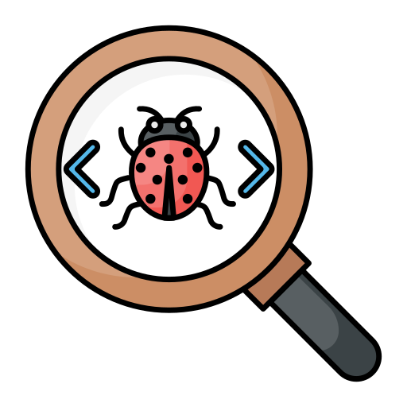

## Hi there, I'm Alina 👋 
### I'm beginner QA Engineer.

###### [image: Flaticon.com](https://www.flaticon.com/ru/authors/shmai)

## My CV 
[Link to my CV](https://drive.google.com/file/d/1_XVGl5Fg_FRaKzevvgYcwrJFpA-W31CQ/view?usp=sharing)

## Tools and languages

## Testing Documentation

* [Checklists]()
* [Test Cases]()
* [Bug Reports]()
* [Postman Collections]()
* [Mind maps]()
